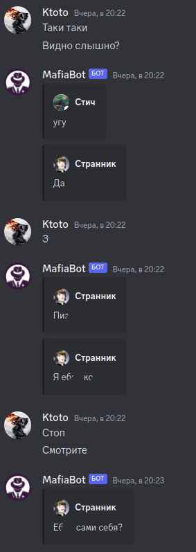

# MafiaBot
Дискорд бот, который упрощает игровой процесс по мафии

### В его функционал входит:
- Раздача ролей
- Создание голосований
- Создание выбора для активных ролей им в лс 
- Логирование действий активных ролей ведущему
- Ночное голосование у мафии
- Мафия чат в личных сообщениях бота
- Предварительное завершение игры

### Фичи
1) Если у пользователя закрыт лс, бот сообщит это в чат. После чего, все действия, сообщения, которые должны отправляться пользователю, будут перенаправлены ведущему

### Настройка
- Создайте файл `token` в директории проекта
- Туда внесите токен бота
- Сохраните файл, и запускайте файл `main.py`

    python main.py

## Скриншотики
### Команды
 
### Запуск
 
### Раздача ролей
 
### Голосование
 
### Выбор у активных ролей
 
### Мафия чат
